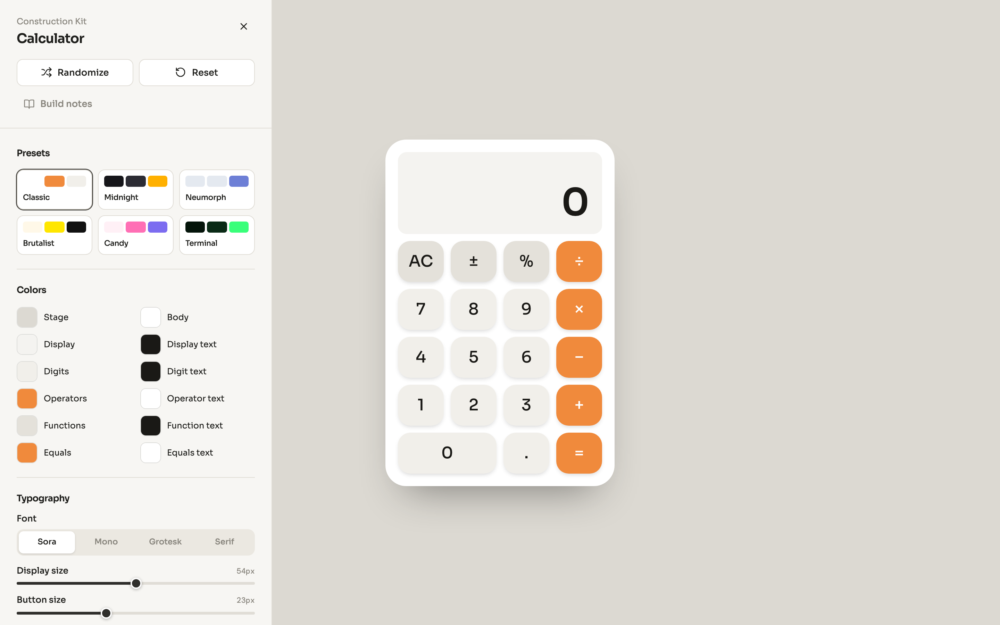
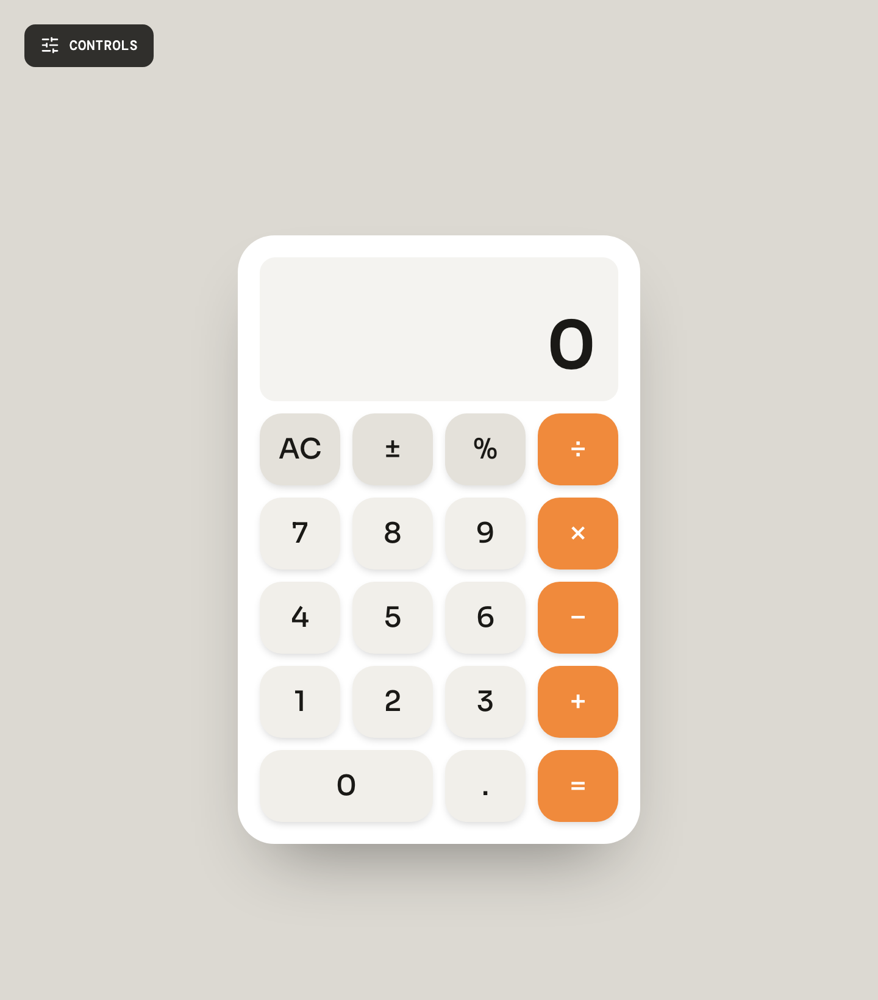
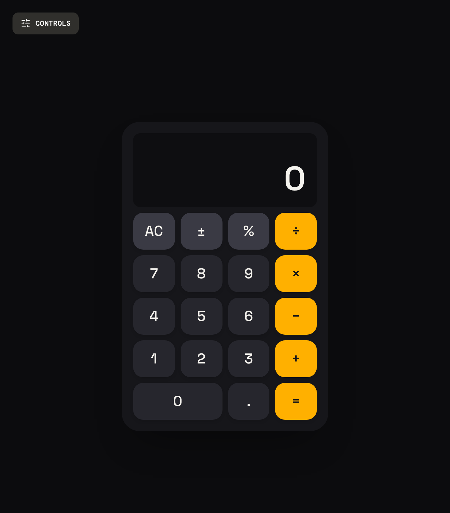
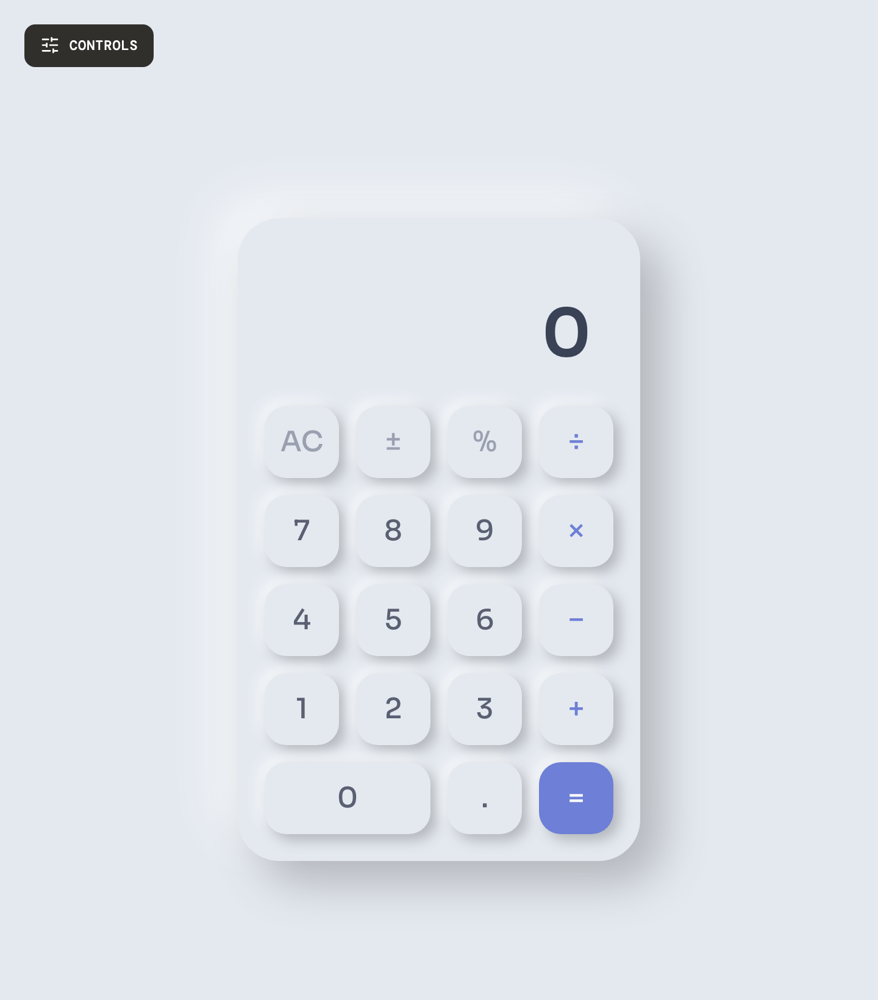
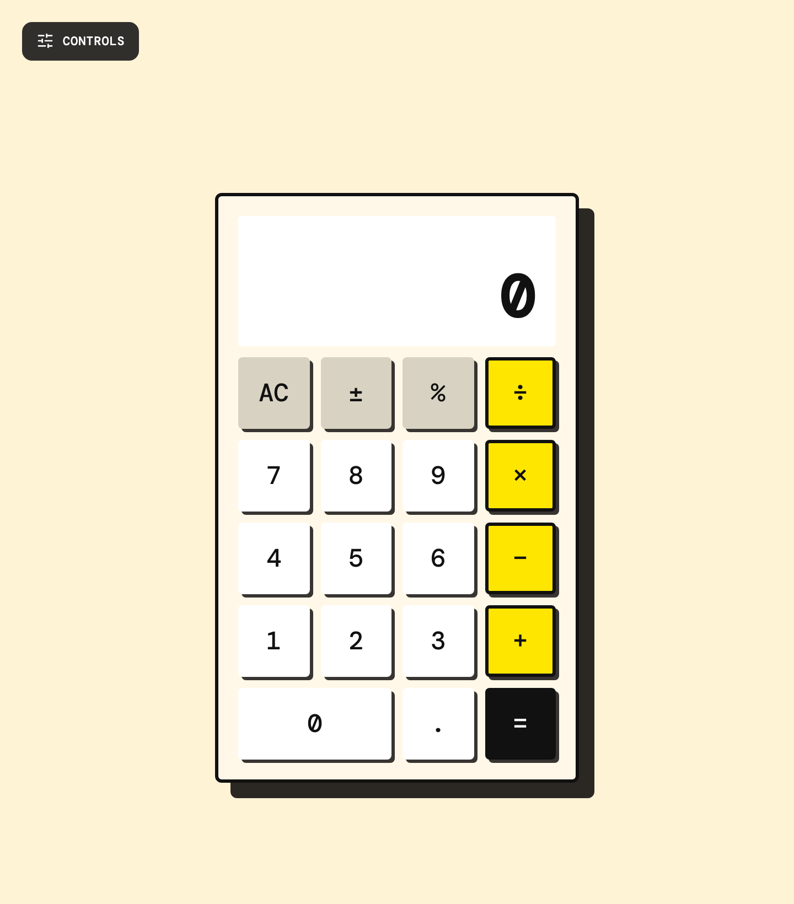
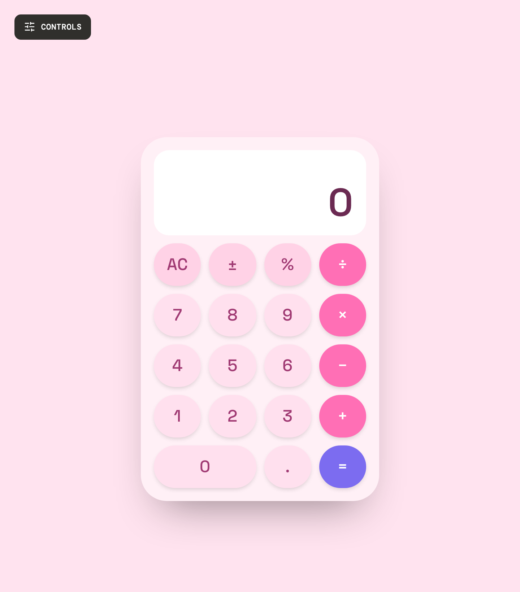
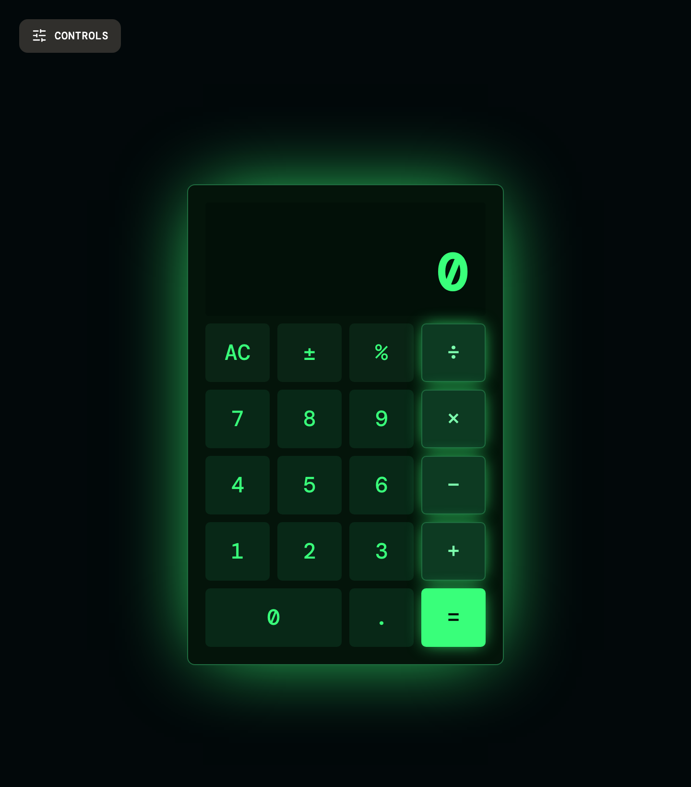

# Calculator Construction Kit

A live **calculator design builder**. A controls sidebar mutates a design model; a working calculator re-renders from it in real time. Tweak colors, typography, shape, shadows and press animations — or start from one of six curated presets — and every change is persisted to `localStorage` so your design survives a reload.



## Overview

- **Design model as the single source of truth** — `src/config/design.ts` declares the option vocabularies, the `CalculatorDesign` shape and the defaults. Everything else is typed against it.
- **Declarative controls** — the sidebar (colors, typography, shape & layout, effects, structure) is driven by descriptors in `src/config/`, not hand-written per field.
- **CSS-variable-driven preview** — the design object is translated into CSS custom properties and `data-*` attributes; all visual styling lives in `src/index.css` under `@layer components`.
- **A real calculator** — a pure, stateless engine (`src/lib/calculator.ts`) powers both on-screen taps and physical keyboard input, with thousands separators and an optional expression line.
- **One-click presets, Randomize and Reset** — jump to a curated look, roll a coherent random design, or return to defaults.

## Presets

Six starting points ship in `src/config/presets.ts`. Each sets colors, font, shape, shadow, press animation and layout in one click.

| Classic | Midnight | Neumorph |
|:---:|:---:|:---:|
|  |  |  |
| Warm neutral body with an orange accent, soft shadows. | Dark chrome with an amber accent. | Soft monochrome, embossed neumorphic buttons. |

| Brutalist | Candy | Terminal |
|:---:|:---:|:---:|
|  |  |  |
| Hard shadows, thick borders, mono type, square keys. | Pastel pink with pill-shaped keys and a violet equals. | Green-on-black phosphor glow, mono type. |

## Tech stack

| Area | Choice |
|---|---|
| Build tool | **Vite 8** |
| UI | **React 19** + **TypeScript** (strict) |
| Styling | **Tailwind CSS v4** (CSS-first `@import "tailwindcss"`) |
| Components | **shadcn/ui** primitives on **Radix UI** |
| Routing | **react-router-dom v7** |
| Icons | **lucide-react** |
| Package manager | **pnpm** |

Import alias `@/*` → `src/*` (configured in `tsconfig.json` and `vite.config.ts`).

## Getting started

```bash
pnpm install
pnpm dev       # start the Vite dev server (binds 0.0.0.0)
```

Then open the printed local URL (default http://localhost:5173).

### Scripts

- `pnpm dev` — start the dev server
- `pnpm build` — type-check (`tsc`) then produce a production build in `dist/`
- `pnpm preview` — serve the built `dist/`

There is no lint or test setup; `pnpm build` (via `tsc`) is the automated check.

## Project structure

```
src/
  config/       design vocab + defaults, control descriptors, keypad, presets
  components/   ControlsPanel, CalculatorPreview, article routes, ui/ primitives
  hooks/        useDesign (state + persistence), useCalculator (engine)
  lib/          calculator engine, storage, randomize, utils
  theme/        ThemeProvider — exposes the design + mutators via context
  index.css     Tailwind entry + @layer components visual styling
```

### Adding or changing a design property

The design model is a cross-cutting concern — a new field touches several files in lockstep:

1. `config/design.ts` — add the field to `CalculatorDesign` + `DEFAULTS`.
2. `config/controls.ts` — add a descriptor so the panel renders a control.
3. `components/CalculatorPreview.tsx` — map the field to a `--css-var` / `data-*` attribute.
4. `src/index.css` — consume that variable/attribute under `@layer components`.
5. `config/presets.ts` and `lib/random.ts` — set it so presets and Randomize stay coherent.

## Routes

- `/` — the builder
- `/developer` — build notes article
- `/blog/react-router-migration` — router migration article

The article routes are `lazy()`-loaded static content, independent of the builder.
